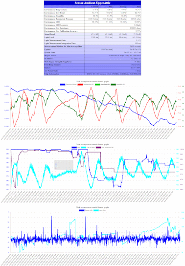
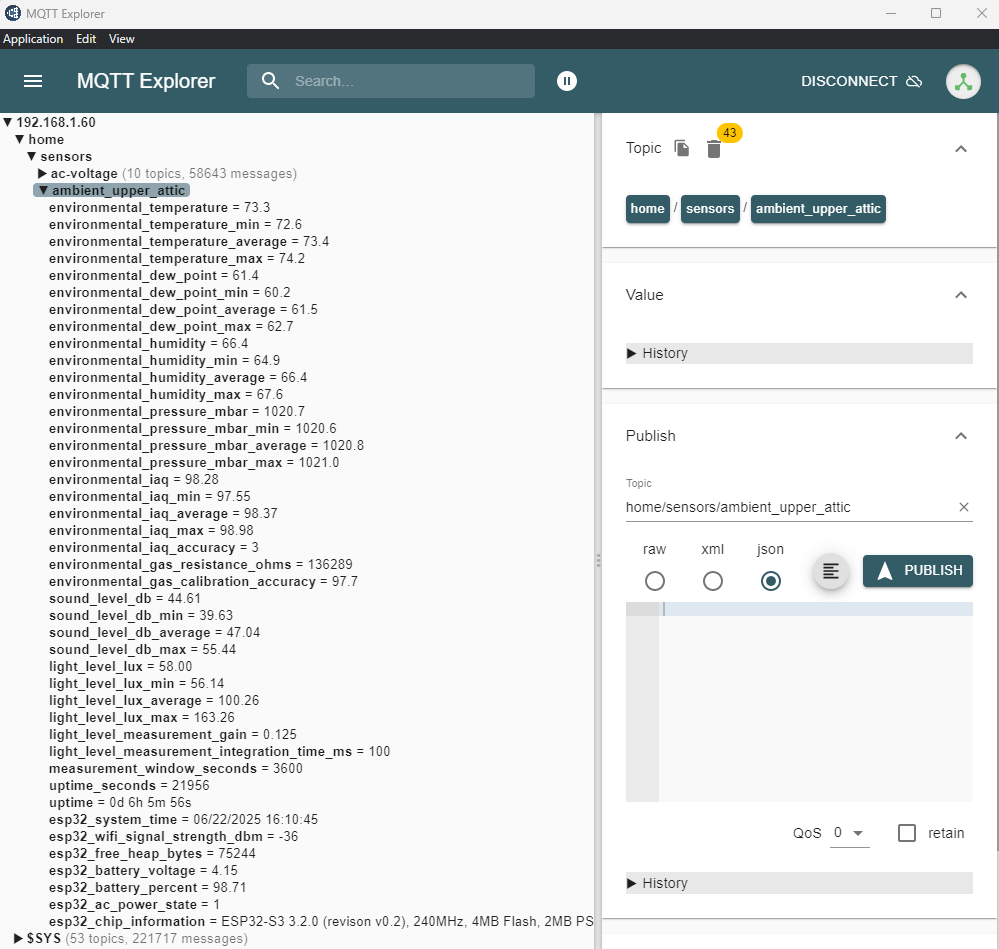
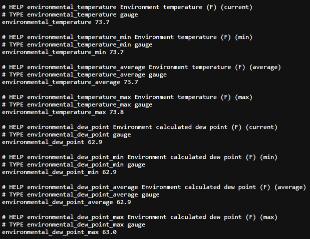

# Sensor: Ambient
This ESP32-S3 project is designed to monitor ambient sound, light, and environmentals in areas such as attics, basements, garages, etc. It provides a rich data set that can be integrated into various home automation platforms through MQTT. It also offers a detailed web interface showing current sensor status and graphs of historical data. A telemetry endpoint is also available for use with observability platforms such as Prometheus.

## Features
- Code is designed to be used with the Arduino IDE
- SPH0645 I2S sound sensor for ambient sound level detection. The sensor does not record audio, it measures sound levels over time.
- VEML7700 I2C light sensor for ambient light level detection. The sensor is not a camera, it uses a single pixel to measure light levels over time.
- BME680 environmental monitoring for temperature, humidity, atmospheric pressure and air quality
- MQTT integration with TLS, user/pass and client certificate options
- NTP support for accurate system time which is also reported to MQTT for sensor online/offline detection
- HTTP status page with detailed sensor information, environmentals, system uptime tracking and historical charts
- HTTP metrics endpoint for use with telemetry systems such as Prometheus
- TFT display support that shows current data, sensor uptime and network address information
- AC power on/off sensing to detect power outages at the sensor location
- LiPo battery backup support to power the sensor through moderate power outages

## Screenshots

### Web Interface
[](assets/screenshot-web-interface.png)

### MQTT


### Telemetry
<br/>
NOTE: This is only a sample of the complete telemetry available.

## Bill of Materials
This solution is based on the ESP32-S3 Reverse TFT Feather from Adafruit. The device integrates a TFT display, a LiPo battery power and charging cicuit, and Stemma QT connectors.
- ESP32-S3 Reverse TFT Feather: [Adafruit #5691](https://www.adafruit.com/product/5691)
- SPH0645LM4H I2S MEMS microphone module: [Adafruit #3421](https://www.adafruit.com/product/3421)
- VEML7700 I2C light sensor module: [Adafruit #4162](https://www.adafruit.com/product/4162)
- BME680 module for collecting environmental data: [Adafruit #3660](https://www.adafruit.com/product/3660)
- Two Stemma QT cables to connect the ESP32 to the VEML7700 and BME280 modules: [Adafruit #4399 or #4210](https://www.adafruit.com/product/4399)
- LiPo battery with JST PH 2.0mm connector (WARNING: Many Amazon batteries do NOT have compatible polarity. Be sure to check the battery connector polarity to ensure that it matches the ESP32 connector!)
- Two 1% precision metal film resistors for AC power sensing: 22k and 12k

## Implementation Overview
- 3D print the included mount if desired
- Assemble the circuit and mount it on the 3D printed base
- Clone this repository
    ```bash
    git clone https://github.com/steveeidemiller/sensor-ambient.git
    ```
- Copy the `config.example.h` configuration file to `config.h` and edit all values to suit the deployment scenario
- Using the Arduino IDE, upload the main sketch and configuration to the ESP32-S3 Feather: [Flashing instructions may be a little different from other ESP32 devices](https://learn.adafruit.com/esp32-s3-reverse-tft-feather/using-with-arduino-ide)
- Verify sensor function by using the HTTP status page

## Wiring
TODO

## Configuration Notes
TODO

## Software Installation
### Library Dependencies
### Uploading
TODO

## 3D Printed Mount

## About the Sensors and Project Development
I thought I'd share some of my journey while developing this sensor platform.

### BME680
The main sensor for this platform. I started with a BME280 but became strongly attracted to adding air quality sensing to the project, which prompted the upgrade (scope creep?). Accuracy appears comparable between the two, but the BME680 seems a bit more stable and only rarely needs software resets. Bosch provides a closed-source library known as BSEC2 to get the air quality readings along with a couple of other derived calculations. BSEC2 generally works well, but is incredibly sensitive to various timings. As such, it did not work well in this project. I'm pushing the ESP32 pretty hard with all of these sensors, MQTT, WiFi and the web interface. That's a lot of processing and doesn't leave much overhead for BSEC2. It would frequently just miss a reading and then never come back. I tried using a dedicated background thread and adjusting its priority, but nothing seemed to work. Since BSEC2 is closed-source, it's all guesswork as to what was actually failing. This prompted me to create my own library [SE_BME680](https://github.com/steveeidemiller/SE_BME680) and use that. Building that library was a HUGE distraction and a major time sink away from this project. My custom library is no BSEC2, but it's open source, can be adjusted as needed, and offers a respectable IAQ approximation for the win. The gas sensor in the BME680 is hyper-sensitive to humidity which made a stable IAQ calculation difficult to achieve. In the end, I think my library works reasonably well. I also moved the dew point calculation and temperature offset into SE_BME680 where those things belong. Both projects ended up heavily intertwined.

### VEML7700
I love this sensor. It was by far the easiest to integrate and has been rock solid stable. Rock. Solid. The Adafruit library is awesome, stable, and provides an auto-gain feature to dynamically adjust to current light levels. Cost is super reasonable as well and the module supports Stemma QT cables for easy connections. During testing, it was glorious to see sunrise and sunset show up on the web interface graphs manifested in gentle, sweeping sensor curves. Given the minimal integration hassle and desire to have as much sensing capability packed into this platform as possible, I couldn't NOT include it. The only issues I had were when BSEC2 was running on a different thread without a semaphore and causing I2C bus contention. Public Service Announcement: don't do that. After moving to my own BME680 library, I put all the I2C code on a single thread so I didn't need a semaphore, and everything has been flawless ever since.

### SPH0645
All that's left is sensing sound, right? I actually started with this sensor because I thought the I2S implementation would be a moderate hassle. However, it was pleasantly straightforward. Not easy, but not nearly as bad as the BME680 rabbit hole, not by a long shot. I began by characterizing the sensor to see how it responded to various sound levels and conditions. Took me a few weeks but I noticed that the digitization had a very definite ceiling along with a "soft" floor. It was easy to peg the sensor with the home theater cranked to eleven. The waveforms would range between min and max values reported through the I2S buffers. I expected more of a "full" range on both upper and lower values, representing peak and valley portions of the digitized audio waveform. The upper range hit a definite ceiling and clipped, which was expected. The lower range danced around a value quite a bit higher than zero, but would actually jump all the way down to zero when clipping. It was strange but consistent. Moderate sound levels stayed within a very reasonable and consistent digital range. I struggled with mapping the sensor's detection to a known SPL reference. Eventually I noticed that the dynamic range could be scaled to a standard SPL scale. It was logarithmic, of course, and needed a scaling factor, but it worked flawlessly. Very high audio levels came in around 120dB and the sensor hovered around 40dB or less overnight with a quiet room. This behavior was consistent in different environments over a period of months, so I baked it into the code. The only unresolved issue is with how "noisy" the SPL graph looks on the web interface compared to the other data graphs. More research is needed there. Overall, the sensor has performed extremely well and has given me zero issues on the ESP32. Its cost is also very reasonable, making inclusion into this platform an easy decision.

### Web
I spent a tremendous amount of time on the web interface. Things started with just the text grid (see screenshots above). However, at some point, I wondered if I could push things just a bit further and render graphs for each data stream (scope creep?). Doing so would require lots of memory to store enough historical data points to make a useful graph, and the ESP32 just doesn't have it. This is where the ESP-S3 variants shine, in particular the Reverse TFT Feather chosen for this project. I chose that device for its built-in screen and LiPo support, but it has extended memory as well in the form of PSRAM!! Every now and then I get a stroke of luck like this. It's rare, but it happens once every few decades whether I'm ready or not. Anyway, it was easy to provision the PSRAM, write data into it, and ship that data out over WiFi as a web asset. Ends up being a little over half a MB in my test project. That allowed me to create much larger charts than I originally planned. Big, audacious, colorful graphs in stunning HTML5 glory. It wasn't long before I realized that the graphs were MUCH more important on the web interface than the text grid. In fact, it's not an overstatement to say that the graphs are now the main "selling" feature of this project; they're that awesome. The graphs also became pivotal in the development process by helping identify data and timing issues, particularly when building the massive distraction known as SE_BME680. Ultimately, I think the web interface really became something incredibly useful and visually compelling. You can even set the polling and retention timings to generate week-long graphs!!

### Telemetry
As an unofficial observability enthusiast, it was important to have a Prometheus endpoint in this project. Sure, MQTT is cool, but I wanted the ability to maintain a data repository over time, and the Prometheus/Grafana ecosystem is perfect for that. There are methods to harvest and store data from MQTT as well, but supporting Prometheus/Grafana is the undisputed industry standard. So, we have three outputs: web, MQTT and Prometheus. That's fairly powerful for an ESP32 sensor project, particularly with all of the data this platform can collect.

### 3D Printed Mount
As an armchair engineer coding in front of the TV, I'm perfectly comfortable having electronic modules dangling from cables and precariously spanning a few small breadboards, all of which hang off my laptop's USB port. Things are as they should be. However, that's not something I can mount in the attic (my intended use case). So, I whipped up a simple mount in OpenSCAD. Nothing fancy, certainly not worthy of any design awards, but it gets the job done. The design emphasizes clear access to the sensor media so that the surrounding environment can be accurately measured. It also has a nice cage for the battery with plenty of airflow. And the base has multiple mounting options. If I have time, I'll make a snap-on cover too.

I printed mine on a heavily modified Prusa MK4 (any proper engineer does not run a stock MK4). Black Polymaker ABS was my filament of choice because it was already loaded, with print settings matching the Voron specs because that's what I already had in the slicer at the time. The ABS worked extremely well and the mount is quite heavy duty, perhaps overly so. I'm sure PLA, PETG and other filaments would work nicely, and print settings are likely not that important. 

# License
This project is licensed under the [MIT License](LICENSE).
