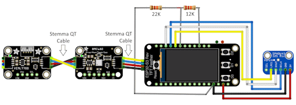

# Sensor: Ambient
This ESP32-S3 project is designed to monitor ambient temperature, humidity, barometric pressure, air quality, sound and light levels in areas such as attics, basements, garages, etc. It provides a rich data set that can be integrated into various home automation platforms through MQTT. It also offers a detailed web interface showing current sensor status and graphs of historical data. A telemetry endpoint is also available for use with observability platforms such as Prometheus.

## Features
- Code is designed to be used with the Arduino IDE
- BME680 environmental monitoring for temperature, humidity, atmospheric pressure and air quality
- SPH0645 I2S sound sensor for ambient sound level detection. The sensor does not record audio, it measures sound levels over time.
- VEML7700 I2C light sensor for ambient light level detection. The sensor is not a camera, it uses a single pixel to measure light levels over time.
- MQTT integration with TLS, user/pass and client certificate options
- NTP support for accurate system time which is also reported to MQTT for sensor online/offline detection
- HTTP status page with detailed sensor information, environmentals, system uptime tracking and historical charts
- HTTP metrics endpoint for use with telemetry systems such as Prometheus
- TFT display support that shows current data, sensor uptime and network address information
- AC power on/off sensing to detect power outages at the sensor location
- LiPo battery backup support to power the sensor through moderate power outages

## Screenshots

### Web Interface
[](assets/screenshot-web-interface.png)

### MQTT


### Telemetry
<br/>
NOTE: This is only a sample of the complete telemetry available.

## Bill of Materials
This solution is based on the ESP32-S3 Reverse TFT Feather from Adafruit. The device integrates a TFT display, a LiPo battery power and charging cicuit, and Qwiic-compatible Stemma QT connectors.
- ESP32-S3 Reverse TFT Feather: [Adafruit #5691](https://www.adafruit.com/product/5691)
- BME680 module for collecting environmental data: [Adafruit #3660](https://www.adafruit.com/product/3660)
- SPH0645LM4H I2S MEMS microphone module: [Adafruit #3421](https://www.adafruit.com/product/3421)
- VEML7700 I2C light sensor module: [Adafruit #4162](https://www.adafruit.com/product/4162)
- Two Stemma QT cables to connect the ESP32 to the VEML7700 and BME280 modules (one 50mm and one 100mm): [Adafruit #4399 and #4210](https://www.adafruit.com/product/4399)
- LiPo battery with JST PH 2.0mm connector (WARNING: Many Amazon batteries do NOT have compatible polarity. Be sure to check the battery connector polarity to ensure that it matches the ESP32 connector!)
- Two 1% precision metal film resistors for AC power sensing: one 22k and one 12k
- Small amount of 24ga solid wire for soldering devices together
- 8 M2x4mm stainless screws for mounting devices to the 3D printed mount
- 8 M3x8mm or M3x10mm stainless screws for fasting the top part of the 3D printed mount to the bottom part

## Implementation Overview
- 3D print the included mount
- Assemble the circuit and mount it on the 3D printed base
- Clone this repository
    ```bash
    git clone https://github.com/steveeidemiller/sensor-ambient.git
    ```
- Copy the `config.example.h` configuration file to `config.h` and edit all values to suit the deployment scenario
- Using the Arduino IDE, upload the main sketch and configuration to the ESP32-S3 Feather: [Flashing instructions may be a little different from other ESP32 devices](https://learn.adafruit.com/esp32-s3-reverse-tft-feather/using-with-arduino-ide)
- Verify sensor function by using the HTTP status page

## Wiring
[](assets/wiring-diagram.png)<br/>
The BME680 and VEML7700 can be connected with the two Stemma QT cables.

Headers are not needed for this project and if used may actually interfere with the 3D mount. So, there is no need to solder them on to the devices. Instead, simply solder wires directly into the holes. The ESP32 ground pin will need to be shared with one resistor leg and one wire to ground the SPH0645LM4H module. A pair of pliers can be used to slightly flatten the end of the resistor leg so that both wires will fit into the ESP32 hole.

The LiPo battery connector MUST be checked for polarity. Many LiPo batteries do not have the correct polarity for the ESP32 module used in this project. They often have the red and black reversed. The JST connectors are designed to allow removal and reinsertion of the pings, so changing the polarity should be straightforward without damaging the connector. It is recommended to plug the battery in last, once the ESP32 has been programmed.

## Configuration Notes
TODO

## Software Installation
TODO

### Library Dependencies
TODO

### Uploading
TODO

## 3D Printed Mount
TODO
NOTE: may not work well with the ESP variant using a w.FL antenna

# License
This project is licensed under the [MIT License](LICENSE).
